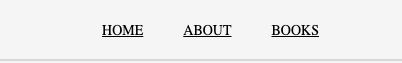
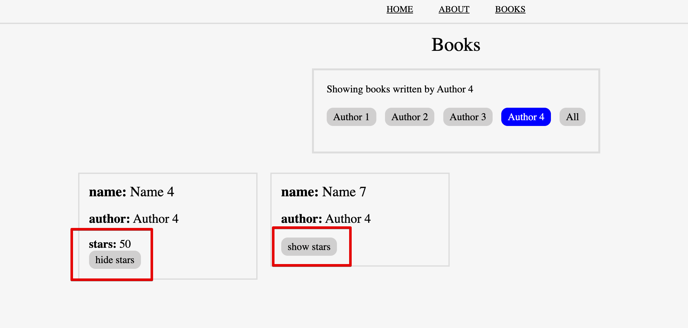
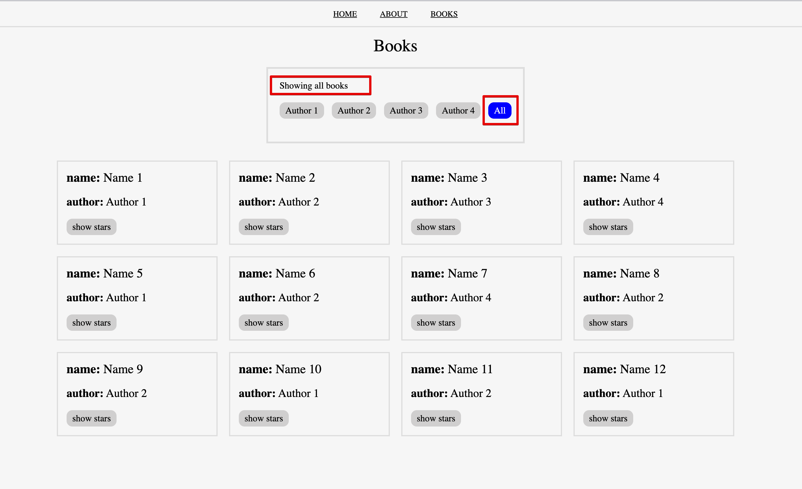
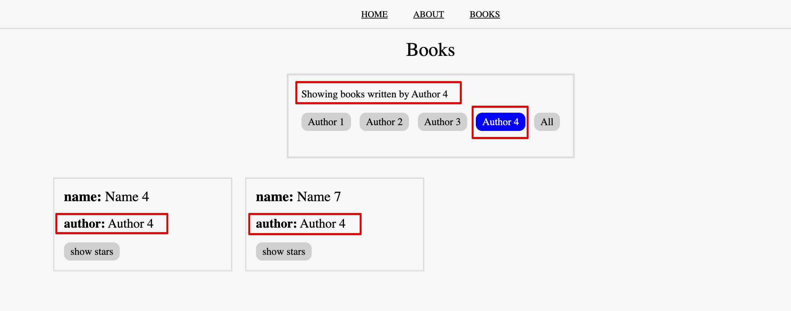

# TASKS

## Before you start
- `npm install` to install all dependencies.
- `npm run dev:db` to run the json-server with hardcoded data. This will be your API.
- `npm run dev` to run the application locally.

## TASK 1 - Don't use inline css
Extract the inline css into a separate css file.
See `footer.module.css` or `footer.css` files for reference

**Acceptance Criteria**
- Implemented using css modules. **(2 pts)**
- Implemented using normal css files **(1 pts)**
- Implemented using global css using `app.css` file **(0.5 pt)**

## TASK 2 - Don't use inline css from scratch
Extract the inline css for 'header' element into a separate css file.

**Acceptance Criteria**
- Implemented using css modules **(2 pts)**
- Implemented using normal css files **(1 pts)**
- Implemented using global css using `app.css` file **(0.5 pt)**

## TASK 3 - Implement the app router
**Description**
Define the routes for home, books and about pages.
The pages are already implemented so you just need to import them.
After you implement the app-router component you need to use it inside the app.jsx component.

For `http://localhost:5173/home` display the `page-home.jsx` component.
For `http://localhost:5173/about` display the `page-about.jsx` component.
For `http://localhost:5173/books` display the `page-books.jsx` component.

**Acceptance Criteria**
- Implement the routing without reloading the browser when navigation between pages. **(5pts)**

## TASK 4 - Implement the navigation!

Implement the navigation. When going from one page to another the browser shouldn't refresh.
Use `react-router-dom` package to achieve the desired result.

"Clicking" on a specific link from your navigation should display the corresponding page if you implemented the previous task correctly. 

**Acceptance Criteria**
- The distance between navigation elements should be 30px. **(1 pt)**
- The navigation is aligned vertically and horizontally inside the header. **(1 pt)**
- The anchor text is underlined, uppercase and has 14px. **(0.5 pt)**
- Navigation elements should be on the same line **(1 pt)**
- Don't remove the `<nav>`, `<ul>` or `<li>` elements. **(0.5 pt)**
  - You can add extra elements if needed or css classes for styling.

## TASK 5 - Load the books from the API.
Use `book-list.jsx` component to display the book list.

Make sure you started the json-server.
In `src/constants/constants.js`you will find a variable that saves the path to your API.
The full books endpoint is `http://localhost:3004/books`.
Look at `db.json` to understand the data.

**IMPORTANT NOTE:** You are free to use any libraries you know that can help you with this task in any way.

**Acceptance Criteria**
- Use `BASE_API` constant when creating the endpoint for the request. **(1pt)**
- Map over all the books,and display each book's name in a simple unstyled list to confirm that you have the data from the API **(1pt)**
- Use the `book-list.jsx` component inside the `page-books.jsx` component. **(1pt)**
- When going for the next task, don't remove the old list, comment it.

## TASK 6 - Use a separate component for the book

Use the `book-item.jsx` component inside `book-list.jsx` component to display more info about the book.
Create another list and leave the list from the previous task in a comment.

**Acceptance Criteria**
- The list from `task 5` is commented and not removed. **(1 pt)**
- `book-item.jsx` component receives the book as props. **(0.5pt)**
- The book-item wrapper(`
`) has a `15px padding` and a border. Border width is `2px`. Border color is `#ddd`. **(0.5pt)**
- Book name has `font size 22px` and a `bottom margin of 18px`. **(0.5pt)**
- Book author has `font size 20px` and `	margin-bottom: 18px`. **(0.5pt)**
- Display the book stars conditionally using a dedicated button. **(5 pt)**
  - Initially the stars are hidden. 
  - The button can toggle the stars visibility. It can hide or show them depending on how many times we click on the button.
  - When the stars are hidden, the button text reads `show stars`.
  - When the stars are visible, the button text reads `hide stars`.

## TASK 7 - Make the book list responsive
Style the `book-list.jsx` so that it would be responsive. 
 
**Acceptance Criteria**
- Display 4 books in a row if the device screen is bigger or equal with 900px. **(1 pt)**
- Display 2 books in a row if the device screen is smaller than 900px. **(1 pt)**

## TASK 8 - Filter the books by authors

You can see that more books has been written by the same author. 
Implement a filter functionality that would allow us to display only the books for a specific author.
There are 4 unique authors `Author 1`, `Author 2`, `Author 3`, `Author 4`.
In a real scenario, we don't kow how many authors are there so we need to extract the unique list of authors from our book list.
If you don't know how to extract the unique list of authors, you can consider that you have only those 4 authors specified above.

**Acceptance Criteria**
- Extract the unique list of author in an array. **(6 pts)**
- Based on author list, display a list of buttons with the author name inside of each button. **(2 pts)**
- When clicking on an author button, the book list should be filtered so that only the books written by the selected author would be displayed. **(2 pts)**
- Display a separate button with text `All` that would reset the list of book to display all our books. **(2 pts)**
- Change the background color to blue and font color to white for the currently active button. **(2 pts)**
- At the top of the author buttons display the text `Showing all books` when all books are showing.  **(1 pt)**
- At the top of the author buttons display the text `Showing books written by [author name]` when books written by a specific author are displayed. **(1 pt)**

# If you still have time, do these for extra points
Task 8 and 9 don't require styling, if you manage to delete or add a new book in db.json 
using the UI you get the max points.

## TASK 8 - Delete a book - max 8pts
Add a delete button to the book thumbnail and when pressed delete that book.
The book should be deleted from db.json as well.

## TASK 9 - Create a new book - max 12 pts
Create a form that would allow you to submit a new book which will be saved in db.json
